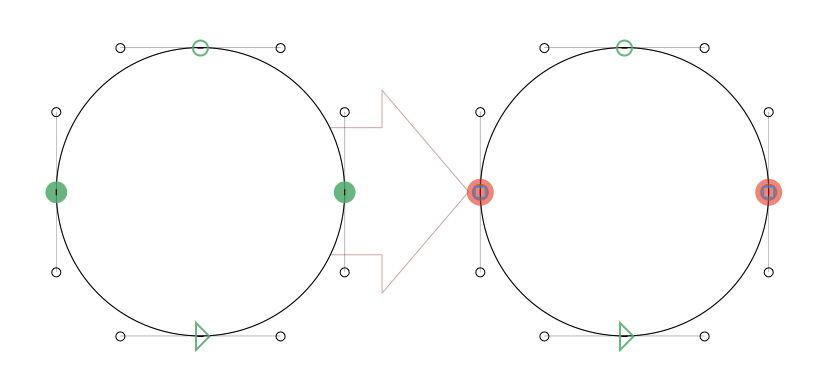

# DuplicateNodes

*Filter > Duplicate Nodes* (*en:* Duplicate Nodes, *de:* Punkte verdoppeln, *fr:* Dupliquer nœuds, *es:* Duplicar nodos, *pt:* Duplicar nodos) is a Glyphs.app filter for duplicating selected on-curve nodes in place.

 
## Usage

Select one or more on-curve nodes in Edit view and run the filter.
 
## Installation

*Duplicate Nodes* is [available in the Glyphs&nbsp;3 Plugin Manager](glyphsapp3://showplugin/Duplicate%20Nodes). Click on the *Install* button next to it and restart Glyphs.
 

# License

Copyright 2022 Rainer Erich Scheichelbauer (@mekkablue). Based on template code by Georg Seifert (@schriftgestalt) and Jan Gerner (@yanone). Help for the conversion into the plug-in by Rainer Erich Scheichelbauer (@mekkablue).

Licensed under the Apache License, Version 2.0 (the "License");
you may not use this file except in compliance with the License.
You may obtain a copy of the License at

http://www.apache.org/licenses/LICENSE-2.0

See the License file included in this repository for further details.
